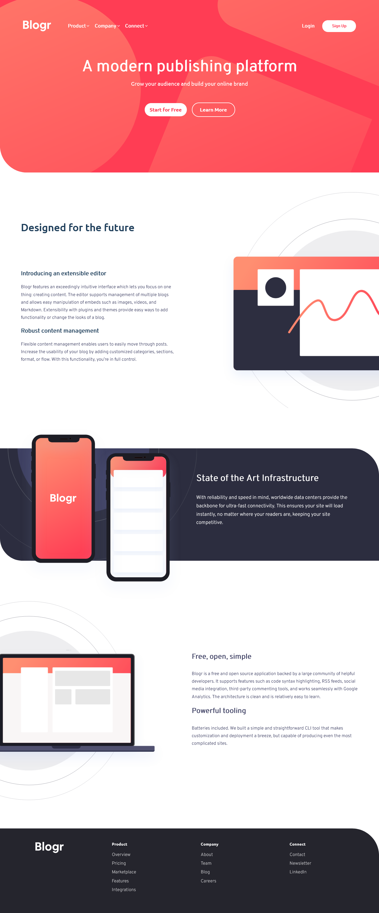

# Frontend Mentor - Blogr landing page solution

This is a solution to the [Blogr landing page challenge on Frontend Mentor](https://www.frontendmentor.io/challenges/blogr-landing-page-EX2RLAApP). Frontend Mentor challenges help you improve your coding skills by building realistic projects. 

## Table of contents

- [Overview](#overview)
  - [The challenge](#the-challenge)
  - [Screenshot](#screenshot)
  - [Links](#links)
- [My process](#my-process)
  - [Built with](#built-with)
  - [What I learned](#what-i-learned)
  - [Continued development](#continued-development)
  - [Useful resources](#useful-resources)
- [Author](#author)

### Screenshot

Then crop/optimize/edit your image however you like, add it to your project, and update the file path in the image above.

### Links

- Solution URL: [Add solution URL here](https://your-solution-url.com)
- Live Site URL: [Add live site URL here](https://your-live-site-url.com)

## My process

### Built with

- Semantic HTML5 markup
- CSS custom properties
- SCSS(Saas)
- Flexbox
- CSS Grid
- Mobile-first workflow

### What I learned

This was very challenging for me especially making the images to the corner of the page, i did it with position relative , but i would like to know if there was an easy way , I am very happy that i managed to complete it even with some small issues.

## Author

- Website - [Portfolio](https://yehan-nilanga.netlify.app/)
- Frontend Mentor - [@Yehan20](https://www.frontendmentor.io/profile/Yehan20)
- Twitter - [@YehanNilanga](https://twitter.com/YehanNilanga)
