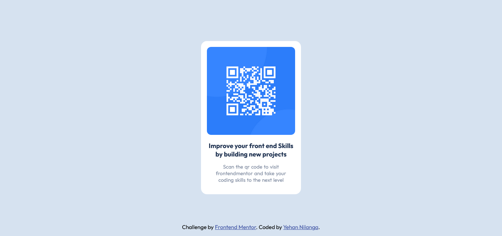

# Frontend Mentor - QR code component solution

This is a solution to the [QR code component challenge on Frontend Mentor](https://www.frontendmentor.io/challenges/qr-code-component-iux_sIO_H). Frontend Mentor challenges help you improve your coding skills by building realistic projects. 

## Table of contents

  - [Screenshot](#screenshot)
  - [Links](#links)
  - [My process](#my-process)
  - [Built with](#built-with)
  - [Author](#author)

### Screenshot

### Links

- Solution URL: [Add solution URL here](https://your-solution-url.com)
- Live Site URL: [Add live site URL here](https://your-live-site-url.com)

## My process
Started from mobile first css, analyzed the design and broke it into html components and designed them seperately. 

### Built with

- Semantic HTML5 markup
- CSS custom properties
- Flex box
- CSS Grid
- Mobile-first workflow

### What I learned

I got a refresher of flex box and mobile first css , i didn't do a lot of html and css these days so it was good exercise for me 

## Author

- Website - [Yehan Nilanga](https://www.your-site.com)
- Frontend Mentor - [@Yehan20](https://www.frontendmentor.io/profile/Yehan20)
- Twitter - [@YehanNilanga](https://www.frontendmentor.io/profile/Yehan20)

