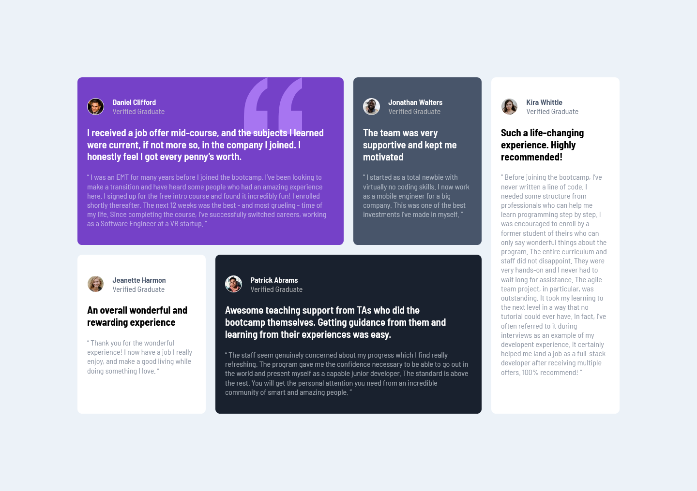

# Frontend Mentor - Testimonials grid section solution

This is a solution to the [Testimonials grid section challenge on Frontend Mentor](https://www.frontendmentor.io/challenges/testimonials-grid-section-Nnw6J7Un7). Frontend Mentor challenges help you improve your coding skills by building realistic projects. 

## Table of contents

- [Overview](#overview)
  - [The challenge](#the-challenge)
  - [Screenshot](#screenshot)
  - [Links](#links)
- [My process](#my-process)
  - [Built with](#built-with)
  - [What I learned](#what-i-learned)
- [Author](#author)

**Note: Delete this note and update the table of contents based on what sections you keep.**

## Overview

### The challenge

Users should be able to:

- View the optimal layout for the site depending on their device's screen size

### Screenshot

### Links

- Solution URL: [click here](https://github.com/Yehan20/Front-End-Mentor-Solutions/tree/main/testimonials-grid-section-main)
- Live Site URL: [click here](https://yn-testimonials-grid-section.netlify.app/)

## My process

### Built with

- Semantic HTML5 markup
- CSS custom properties
- Flexbox
- CSS Grid

### What I learned

Got some hands on using css grid , tested different grid properties to find the best fit

## Author

- Website - [portfolio](https://yehan-nilanga.netlify.app/)
- Frontend Mentor - [@Yehan20](https://www.frontendmentor.io/profile/Yehan20)

